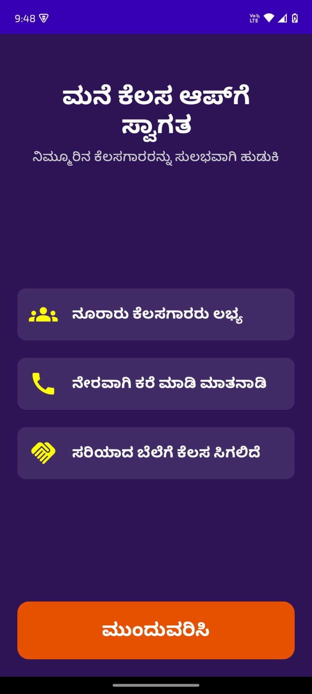
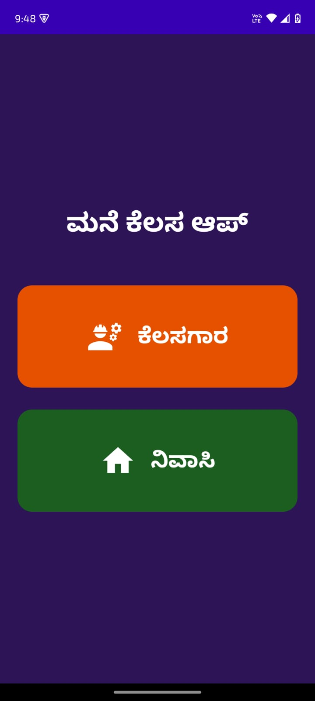
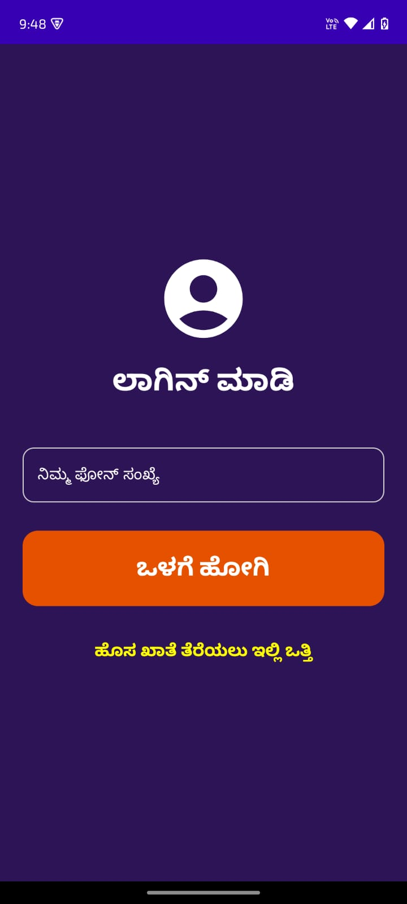
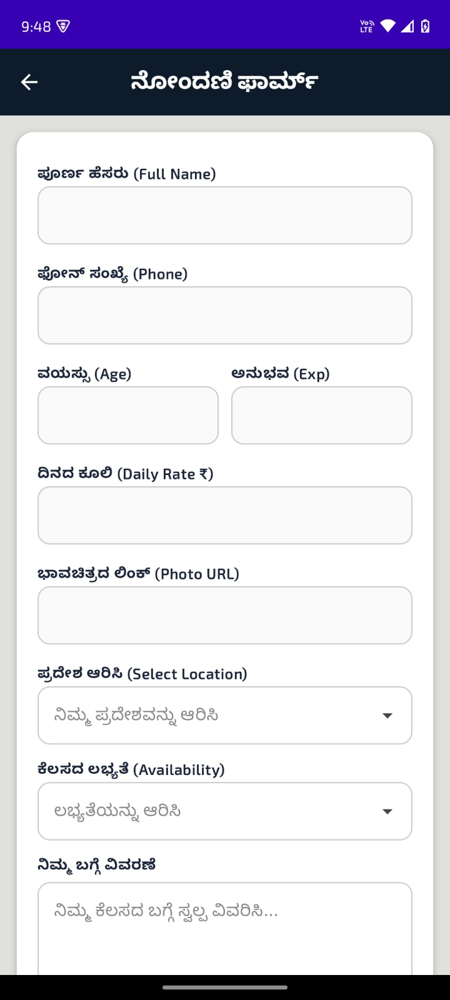
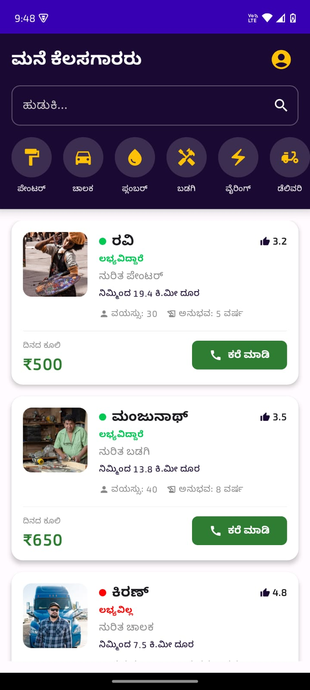
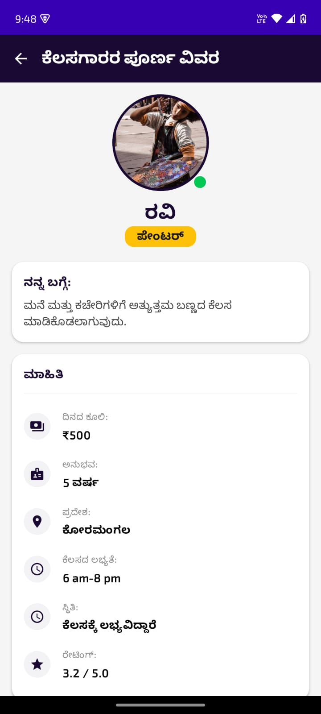
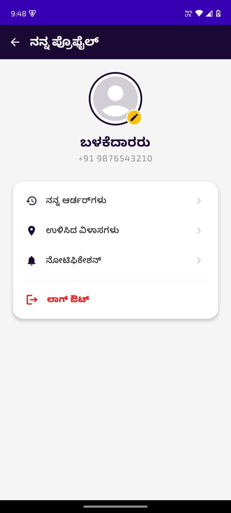

# ManeKelsaApp (ಮನೆಕೆಲಸ ಆಪ್) 🏠🛠️

## 📸 App Screenshots

   
  
  

  
  
  

  

ManeKelsaApp is a service-oriented mobile platform built with **Jetpack Compose** and **Firebase**. It connects residents in Bengaluru (Peenya, Dasarahalli, etc.) with local workers like painters, drivers, and plumbers.

## ✨ Key Features
* **100% Kannada Localization:** The entire interface is in Kannada for local accessibility.
* **Neighborhood Focus:** Targeted services for local residents.
* **Worker Profiles:** View skills, ratings, experience, and daily rates.
* **Direct Call:** One-tap calling to connect with workers instantly.

## 🛠️ Tech Stack
* **Language:** Kotlin
* **UI Framework:** Jetpack Compose
* **Backend:** Firebase Firestore & Realtime Database
* **Image Loading:** Coil
* **Architecture:** MVVM

## ⚙️ How to Run
1. Clone this repository.
2. Add your `google-services.json` to the `app/` folder.
3. Build and run in Android Studio.
